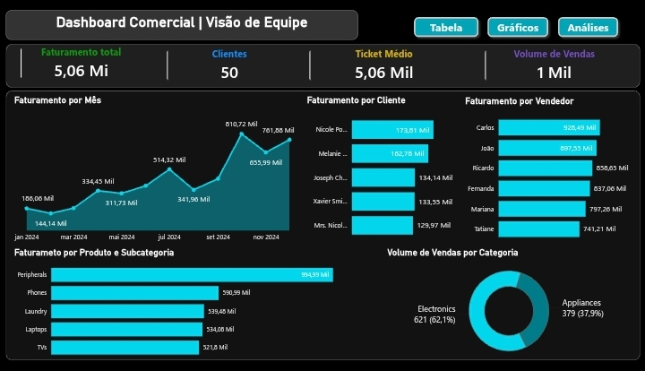
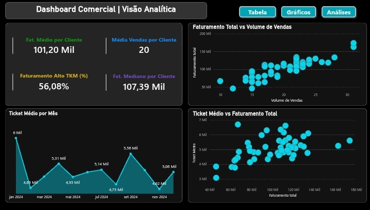

# Case 2: Análise de Vendas (Power BI)

# Introdução

Este projeto tem como objetivo desenvolver uma solução completa de **Business Intelligence (BI)** para avaliar o **desempenho comercial**, a **eficiência de faturamento** e o **comportamento de compra** de uma carteira de clientes ativos. A análise e a estruturação dos dados foram conduzidas integralmente no **Power BI**, cobrindo todas as etapas fundamentais de um pipeline de dados: extração, tratamento e limpeza (ETL), modelagem dimensional e design de dashboards.  
  
O foco do projeto foi aplicar **lógica analítica**, **modelagem de dados** e engenharia de fórmulas **DAX** para transformar tabelas transacionais brutas e descentralizadas em um **painel altamente interativo**. A solução desenvolvida visa eliminar pontos cegos operacionais e fornecer diagnósticos rápidos e precisos para dar suporte estratégico à tomada de decisão.

  

  

---

# Contexto e Problema de Negócio

A liderança comercial enfrentava dificuldades para obter uma leitura clara e centralizada da performance de vendas e do comportamento da carteira de clientes. As informações de faturamento e operações encontravam-se descentralizadas e em formato bruto, gerando pontos cegos estratégicos e morosidade na extração de indicadores confiáveis.

Para direcionar o crescimento do negócio, a gestão técnica de Inteligência estipulou um projeto que foi estruturado para mitigar as seguintes dores de negócio:

- **Falta de Visibilidade de KPIs Críticos:** Inexistência de um fluxo automatizado para acompanhar métricas essenciais de saúde comercial, como Faturamento Total, Ticket Médio por transação e a evolução temporal das vendas.
- **Pontos Cegos na Carteira de Clientes:** Dificuldade para mensurar a volumetria de Clientes Ativos e suas quantidades de vendas e identificar com rapidez assimetrias e dispersões no comportamento de compra da carteira.
- **Estrutura de Dados Descentralizada:** Necessidade de consolidar e auditar dados brutos provenientes de tabelas transacionais e cadastros auxiliares, exigindo um pipeline rigoroso de tratamento e modelagem para garantir a consistência das informações antes da tomada de decisão.

---

# Tecnologias e Ferramentas Utilizadas

- **Power BI:** Construção, Modelagem e Visualização de dados.
- **Power Query:** Processos de ETL (Extração, Transformação e Carregamento).
- **Modelagem de dados e Relacionamentos:** Arquitetura **Star Schema** com conexões 1:N e integridade referencial.
- **DAX (Data Analysis Expressions):** Criação de Métricas e Indicadores de negócio.

---

# Pipeline de dados e Arquitetura

## 1. Extração e Tratamento de dados (ETL)
Utilizando o **Power Query**, foi realizado o pipeline completo de limpeza e transformação da base bruta:
- Eliminação de redundâncias, tratamento de valores nulos e tipagem correta dos dados.
- Otimização da base para garantir a performance de carregamento e atualização do relatório.

## 2. Modelagem Dimensional (Star Schema)
Para garantir eficiência e escalabilidade nas consultas, os dados foram estruturados seguindo o modelo **Star Schema**:
- **Tabela Fato:** Centralização dos registros operacionais e históricos de vendas.
- **Tabela Dimensão:** Tabelas auxiliares (Clientes, Produtos, Vendedores) conectadas via relacionamentos de *1:N* (um para muitos), otimizando a performance dos filtros e do motor analítico.

## 3. Engenharia de Métricas com DAX
Desenvolvimento de uma camada robusta de medidas em **DAX** para extrair os principais indicadores de performance (KPI's) comerciais, que são:
- **Faturamento Total:** Valor arrecadado pela empresa.
- **Ticket Médio:** Valor médio gasto por cliente em transação/pedido.
- **Clientes Ativos:** Quantidade de clientes únicos que realizaram pelo menos uma compra no período.
- **Volume de Vendas:** Quantidade total de itens ou transações comerciais realizadas.

Além disso, a análise foi desdobrada para avaliar a performance do faturamento por **Cliente, Vendedor, Produto, Categoria e Subcategoria, e por Mês**. A disposição desses elementos no dashboard foi planejada utilizando gráficos adequados para cada segmento, respeitando o padrão de **Leitura em Z** e aplicando boas práticas de **Storytelling e Direcionamento Visual Claro**, garantindo que o usuário final encontre as respostas estratégicas de forma fluida e intuitiva.

---

# Estrutura do Dashboard

O relatório foi desenvolvido em **Dark Mode** (Fundo escuro moderno para melhor contraste visual e destacar KPI's), aplicando conceitos modernos de UI/UX, navegação intuitiva por **botões** e foco na **redução da fadiga visual** do usuário técnico. Ele é dividido em duas visões estratégicas:

1. **Painel Técnico (KPI's Gerais):** Visão macro voltada para a liderança, consolidando os principais indicadores de saúde comercial, faturamento e metas de forma rápida e direta.
2. **Painel Criativo (Diagnósticos Avançados):** Visão analítica profunda que utiliza métricas e visuais avançados, como **Faturamento Médio e Mediano** e **Gráficos de Dispersão**, permitindo ao analista identificar tendências, relações, anomalias e assimetrias e mapear diagnósticos e gargalos operacionais ou de vendas.

---

# Insights e Principais achados

Após a estruturação do pipeline de dados e a construção do dashboard comercial, foi possível extrair diagnósticos valiosos sobre a saúde financeira e o comportamento da carteira de clientes:

## 1. Métricas Gerais

A página inicial do dashboard apresenta o Painel Técnico, uma visão macro projetada para fornecer à liderança diagnósticos rápidos sobre a saúde comercial do negócio. Nele, destacam-se quatro KPI's fundamentais calculados via DAX:

- **Faturamento Total:** Atingiu a marca de *5,06 Mi*. Este valor representa o desempenho financeiro bruto e indica uma operação com **escala considerável** e um fluxo de receita robusto para o período.
- **Clientes:** O painel registra *50 clientes ativos*. Este número revela uma carteira de clientes **enxuta** e **estratégica**; dada a magnitude do faturamento, cada cliente possui um alto valor para o negócio, indicando um modelo focado em grandes contas (High TKM).
- **Ticket Médio:** Consolidado em *5,06 Mil*. Este KPI sinaliza que a empresa comercializa produtos de **alto valor agregado** ou realiza **vendas em grandes lotes**, exigindo uma abordagem comercial qualificada.
- **Volume de Vendas:** Registrou o total de *1 Mil* transações. Ao cruzar este dado com a base de 50 clientes ativos, percebe-se uma alta taxa de recorrência (média de 20 pedidos por cliente), o que demonstra **fidelidade à marca** e **eficiência na retenção da carteira**.

Esses indicadores foram posicionados seguindo o padrão de **leitura em Z**, garantindo que as métricas mais críticas de desempenho e volumetria sejam as primeiras informações absorvidas pelo usuário.

## 2. Faturamento Mensal

Logo abaixo do painel de indicadores, o gráfico de Faturamento por Mês detalha a evolução temporal das vendas ao longo de 2024, permitindo identificar padrões de sazonalidade e o ritmo de crescimento do negócio:

- **Tendência de Crescimento:** Observa-se uma clara trajetória de **ascensão** no faturamento ao longo do ano. O negócio inicia em Janeiro com 186,06 Mil e, apesar de uma leve queda em Fevereiro, demonstra uma recuperação consistente, mudando de patamar a partir do segundo semestre.
- **Pico de Performance:** O mês de outubro registra o ápice de faturamento, com 810,72 Mil, seguido de perto por novembro com 761,88 Mil. Esse comportamento sugere uma **forte sazonalidade positiva no último trimestre**, indicando que o período é crítico para o atingimento das metas anuais.
- **Volatilidade e Recuperação:** O gráfico revela pontos de oscilação, como a queda em agosto após um excelente mês de Julho. No entanto, a capacidade de recuperação imediata nos meses seguintes aponta para uma **operação comercial resiliente** e com **alto poder de reação**.
- **Maturação da Operação:** A comparação entre o primeiro e o último trimestre mostra que a empresa encerra o ciclo anual em um nível de receita muito superior ao inicial. Enquanto a média dos primeiros meses se manteve baixa, o encerramento do ano consolida valores consistentemente altos.

Num geral, a análise temporal do faturamento valida a **escalabilidade** do negócio ao longo de 2024, demonstrando que a operação não apenas cresceu em volume, mas também amadureceu em termos de previsibilidade. A identificação clara do pico de vendas nos últimos meses fornece um insumo estratégico fundamental para o planejamento preditivo . Com base nesses dados, a gestão pode realizar um provisionamento de estoque e alocação de recursos mais assertivos para os períodos de alta demanda, garantindo que o crescimento observado seja sustentado com eficiência operacional nos ciclos seguintes.

## 3. Faturamento por Cliente

O ranking de Faturamento por Cliente destaca os principais parceiros comerciais da operação, evidenciando as contas que mais contribuíram para o resultado global. 

- No topo da lista, destacam-se *Nicole* (173,81 mil) e *Melanie* (162,78 mil), seguidas por outros clientes que mantêm uma média de faturamento em torno de *130 mil*.
- Essa distribuição confirma a eficácia da estratégia de foco em **High TKM** (Ticket Médio Alto), onde o sucesso financeiro é impulsionado por um grupo seleto de clientes de alto valor agregado. 

O fato de os principais clientes apresentarem valores próximos sugere uma **carteira saudável** e **bem distribuída** entre as contas estratégicas, o que reduz o risco de dependência excessiva de um único comprador.

## 4. Faturamento por Vendedor

O gráfico de Faturamento por Vendedor revela a performance individual da força de vendas.

- Com *Carlos* (928,49 mil) e *João* (897,55 mil) liderando os resultados. 
- É notável que todos os vendedores listados apresentam um desempenho **consistente**, mantendo-se na faixa entre 740 mil e 930 mil de faturamento.

A baixa dispersão entre o primeiro e o último colocado do ranking indica uma **equipe comercial madura e homogênea**. Esse equilíbrio é um indicador positivo, pois demonstra que os processos de vendas e o acesso ao mercado estão bem alinhados em todo o time, garantindo resultados robustos sem depender de um único "superstar" para bater as metas.

## 5. Faturamento por Subcategoria e Produto

O gráfico de Faturamento por Produto e Subcategoria utiliza uma estrutura de hierarquia que permite analisar desde as grandes divisões de mercado até os itens individuais mais vendidos (através da dupla seta apontada para baixo).

- **Liderança de Subcategorias:** A subcategoria de **Peripherals** (Periféricos) posiciona-se como o principal motor de receita, acumulando sozinha 994,99 mil. Este valor representa uma vantagem expressiva de cerca de 400 mil..

- **Performance por Produto (Drill-down):** Ao descer para o nível de detalhe por item, o **Smartphone Z10** destaca-se como o "produto estrela" do portfólio, gerando um faturamento de 590,99 mil. Por outro lado, observa-se que a liderança dos Periféricos é consolidada pela performance combinada de dois itens de alto valor: o **Gaming Mouse X500** (541,63mil) e o **Mechanical Keyboard Pro** (453,36 mil).

A análise cruzada entre subcategorias e produtos revela informações estratégicas sobre a composição do faturamento. É notável que o faturamento da subcategoria Phones é composto integralmente (ou quase em sua totalidade) pelas vendas do Smartphone Z10, o que indica uma alta dependência de um único produto específico neste segmento. Já a subcategoria de **Peripherals**, embora líder em faturamento, possui uma **receita mais distribuída** entre diversos itens de alto valor, como o Gaming Mouse X500 e o Mechanical Keyboard Pro. O fato de estar isoladamente no topo com uma distância tão vasta para os demais segmentos indica que a empresa possui uma autoridade de mercado consolidada nesta categoria.

Essa configuração demonstra que, enquanto a empresa possui uma âncora de vendas nos smartphones, sua maior força financeira reside no ecossistema de periféricos, que apresenta um volume agregado superior e menor risco por produto individual. Para a gestão, isso sugere que campanhas de **cross-selling** (venda cruzada) entre o Smartphone Z10 e os periféricos de elite podem ser uma via eficaz para elevar ainda mais o Faturamento e Ticket Médio da operação.

## 6. Volume de Vendas por Categoria

O gráfico de rosca detalha como as **1 mil transações** realizadas no período se distribuem entre os dois grandes segmentos da empresa, fornecendo uma visão clara da representatividade operacional de cada área:

- **Predomínio de Electronics (Eletrônicos):** Esta categoria consolida-se como o principal pilar de movimentação comercial, sendo responsável por 62,1% do volume total, o que equivale a **621 vendas**.

- **Participação de Appliances (Eletrodomésticos):** O segmento de eletrodomésticos responde pelos 37,9% restantes, totalizando **379 transações**.

A distribuição do volume revela que a operação possui um **DNA focado em tecnologia**, com mais de *60%* das interações de venda concentradas em eletrônicos. Ao cruzar este dado com o faturamento, percebemos que a categoria de Electronics não apenas lidera em quantidade de pedidos, mas também sustenta as subcategorias de maior valor financeiro, como Periféricos e Smartphones.

Essa configuração indica uma especialização clara do time de vendas e uma percepção de marca consolidada no setor tech. Para um futuro estratégico, o desafio está em entender se a menor volumetria de eletrodomésticos deve-se a um ticket médio ainda mais elevado ou a uma oportunidade de expansão de mercado. Utilizar a base fiel de clientes de eletrônicos para introduzir produtos de utilidade doméstica via campanhas direcionadas pode ser uma alavanca eficiente para equilibrar o mix de vendas e aumentar o faturamento por cliente.

## Métricas avançadas

A segunda visão do relatório, o **Painel Criativo**, oferece uma visão analítica profunda, projetada para identificar **tendências, relações e anomalias** que impactam a estratégia de vendas. Nele, destacam-se quatro indicadores avançados calculados via DAX que permitem um diagnóstico detalhado do comportamento e da qualidade da carteira de clientes:

- **Faturamento Médio por Cliente:** Este indicador reflete o valor bruto que cada cliente traz, em média, para a operação, confirmando o posicionamento do negócio em contas de alta relevância estratégica.
- **Média Vendas por Cliente:** Refere-se à taxa de recorrência e fidelidade da base; ao invés de transações isoladas, o faturamento é sustentado por um ciclo constante de recompras por parte dos clientes ativos.
- **Faturamento Alto TKM (%):** Representa a proporção da receita total proveniente de transações de ticket médio elevado. Ter mais da metade do faturamento vindo de "Alto TKM" evidencia o sucesso na comercialização de produtos de maior valor agregado.
- **Faturamento Mediano por Cliente:** Representa a receita média da metade (50%) dos clientes ativos. Por estar muito próximo à média, este valor é um forte indicador de saúde e homogeneidade da carteira. Ele comprova que o faturamento total não é distorcido por apenas um ou dois clientes excepcionais, mas sim fruto de uma performance consistente e equilibrada entre os principais parceiros comerciais.

## Faturamento x Vendas

O gráfico de dispersão no Painel Criativo permite uma análise profunda da eficiência comercial ao cruzar o volume transacional com o retorno financeiro. Abaixo, destacam-se os principais achados sobre essa relação:

- **Correlação Positiva e Comportamento Padrão:** Existe uma tendência clara de **crescimento linear entre o volume de vendas e o faturamento total**. A maioria dos clientes se concentra em um "cluster" saudável de aproximadamente 20 vendas, gerando faturamentos individuais em torno de 100 mil (correspondendo às médias).
- **Identificação de Outliers:** O visual mapeia clientes que rompem a média, atingindo **mais de 30 vendas** e **faturamentos superiores a 150 mil**, representando os parceiros de maior peso na receita bruta.
- **A Anomalia do TKM (Ticket Médio):** Um dos insights mais valiosos é a identificação de que o maior Ticket Médio da operação **não** pertence aos clientes que mais faturam ou que compram com mais frequência. Na verdade, o maior TKM está localizado em cliente que registrou um dos menores faturamentos e volumes de venda (cerca de 10 transações no extremo esquerdo do gráfico).  
Essa distorção revela que, embora esse cliente específico tenha um impacto menor no faturamento acumulado, cada transação realizada por ele é de **altíssimo valor unitário**. Isso valida o indicador de 56,08% de Faturamento Alto TKM, mostrando que a rentabilidade do negócio é sustentada por nichos de **produtos premium**.

Essa descoberta reforça que o dashboard cumpre seu papel de eliminar **"pontos cegos"**, provando que o volume de vendas não é o único driver de sucesso. Para a gestão, esse achado sugere que existe um perfil de cliente **"premium silencioso":** ele compra pouco em termos de recorrência, mas quando compra, adquire os itens de maior valor agregado do portfólio. Uma boa recomendação é que focar na expansão dessa base de alto ticket pode ser uma estratégia mais rentável do que apenas buscar o aumento indiscriminado do volume de vendas transacionais.

## Faturamento e Árvore de Decomposição

A Árvore de Decomposição, integrada ao Painel Criativo, atua como uma ferramenta fundamental para a **rastreabilidade e o diagnóstico profundo do negócio**. Sua grande importância reside na **alta interatividade**, permitindo que o usuário realize um drill-down dinâmico para **avaliar como as receitas se distribuem através de múltiplos níveis de detalhamento** sem a necessidade de múltiplos visuais estáticos.

Na prática, ela permite identificar os **vendedores** que mais vendem certo **produto X** da **subcategoria Y** da **Categoria Z** para certos **clientes**, sendo essencial para acompanhar o fluxo de receita. Como demonstrado no visual, é possível rastrear o faturamento desde o nível macro de categorias até a ponta final da venda, revelando exatamente quais combinações de produtos e clientes estão impulsionando os resultados de cada consultor.

Ao revelar quais clientes e consultores estão por trás da performance de cada item, a árvore elimina pontos cegos operacionais e fornece à gestão uma compreensão granular de quais componentes estão movendo os ponteiros da organização.

---

# Conclusão

Este projeto demonstra como o **domínio do Power BI** e a **aplicação de processos rigorosos de engenharia de dados** — abrangendo ETL, modelagem dimensional e cálculos avançados em DAX — permitem construir uma **visão completa do desempenho comercial**, conectando registros transacionais brutos a diagnósticos estratégicos de alto nível.  
  
O foco foi evidenciar a **capacidade analítica**, o **domínio técnico** e a **visão de negócio**, transformando bases de dados descentralizadas em uma estrutura robusta sob a arquitetura Star Schema para eliminar pontos cegos operacionais.  
  
Através de visuais de alta **interatividade** e **métricas de vendas**, a solução converte o faturamento bruto em informações estruturadas, garantindo rastreabilidade total e **suporte direto à tomada de decisão** baseada em fatos e dados (data-driven).

[Acesse o Dashboard Completo interativo aqui](https://app.powerbi.com/view?r=eyJrIjoiMmVkNjExOTItYzBmYi00ZTVkLWEzNTktZjFmZjliNzY1YjZiIiwidCI6ImIzNGMxZDU1LWE0M2UtNGEyMC05MjE4LWExYTQyZWFiMTQ5YSJ9)
