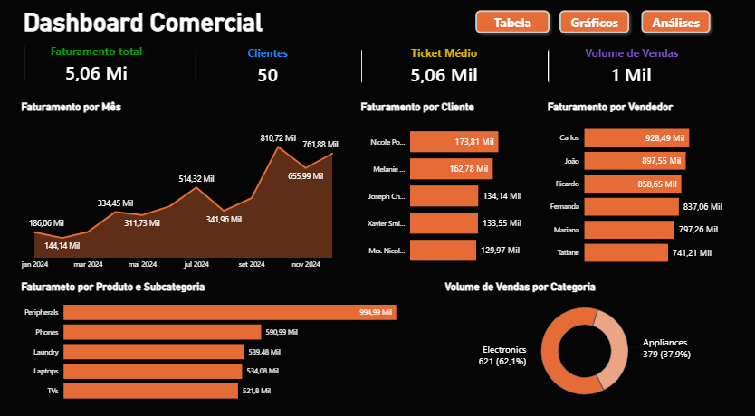
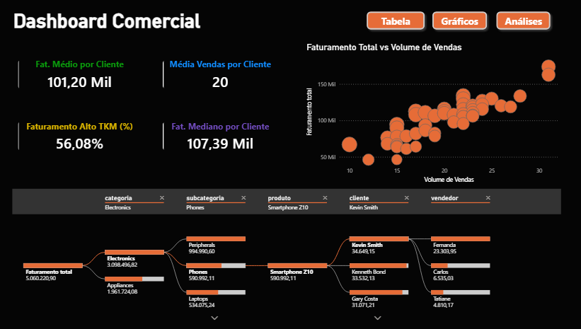

# Case 2: Análise de Vendas (Power BI)

# Introdução

Este projeto tem como objetivo desenvolver uma solução completa de Business Intelligence (BI) para avaliar o desempenho comercial, a eficiência de faturamento e o comportamento de compra de uma carteira de clientes ativos. A análise e a estruturação dos dados foram conduzidas integralmente no Power BI, cobrindo todas as etapas fundamentais de um pipeline de dados: extração, tratamento e limpeza (ETL), modelagem dimensional e design de dashboards.

O foco do projeto foi aplicar lógica analítica, modelagem avançada de dados e engenharia de fórmulas DAX para transformar tabelas transacionais brutas e descentralizadas em um painel altamente interativo. A solução desenvolvida visa eliminar pontos cegos operacionais e fornecer diagnósticos rápidos e precisos para dar suporte estratégico à tomada de decisão da alta liderança.

  

---

[Ver Dashboard interativo](https://app.powerbi.com/view?r=eyJrIjoiMmVkNjExOTItYzBmYi00ZTVkLWEzNTktZjFmZjliNzY1YjZiIiwidCI6ImIzNGMxZDU1LWE0M2UtNGEyMC05MjE4LWExYTQyZWFiMTQ5YSJ9)
